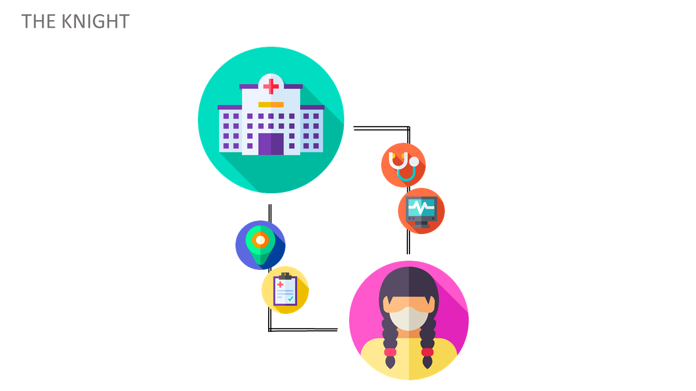

 
## About
Knight ECU is one of the roles in [Project ECU](https://github.com/spitzc32/Project-ECU) that mainly acts as a support for the Head. It is mainly focused on the Information Services side of the whole Community, especially when it comes to the health of its members. It continuously checks and writes reviews about the inputted medical history and self diagnosis conducted and gives advice through reviews and send them a notification if ever they need more details regarding your shared information. They will specify which practitioner sent the message in order for you to keep track to whom you send information to.      

## How it Works
It mainly plays a role as a monitoring device for important health information. Using OneSignal API, it distributes the information locally obtained through the pawns to update them about the information obtained on either through a review or a message.            



The illustration above represents the basic flow of the Knight on which, as mentioned before, mainly focuses on the Information Services. We can see the information being gathered here is being stored as an update like a ledger that keeps on track of the reviews and messages if it is within the vicinity of the Knight or if it is requested by the Head. 


### Who can use Knight ECU?
This website is intended for the use of an instition that can are licensed as a practitioner or a hospital that has some available practitioners. The person who can use this website can be a head of an organization that sets out to help a particular area as long as it nis nearby their vicinity. For establishments and partnered hospitals see the other folders in the source code and for individual users please use the application.

### Getting Started
Before proceeding please do the prerequisites in [Project ECU](https://github.com/spitzc32/Project-ECU). Those are the dependencies needed in order for this web application to work. Also do take note that each page has its specified purpose please read their usage in each of their source code before using it. This web application runs on local host port 5000. Make sure that any other service that uses this port are turned off. 

#### Setup
Please follow the prerequisites in [Project ECU](https://github.com/spitzc32/Project-ECU) before running the program.There are numerous setup of credentials and API keys in numerous files namely: 

In app.py, there are numerous comments that states where they are using the API keys and credentials for the database and also the file given to you. First of all let us set up the **firebase-sdk.json** that was given during the submission.

```
#first of all please go to this directory of the file.

cd ProjectECUAdmin

# Then add a copy of firebase-sdk.json in this directory.
```
In **oneSignalAppID**, paste the credential named **firebaseConfig** in this comment
```
oneSignalAppID= "" #paste oneSignalAppID here
```
In **app.py**, paste the credential named **firebaseConfig** in this comment
```app.py
firebaseConfig = {} # Paste firebaseConfig Credentials here
```
In databaseURL, paste the credential named **dbURL**
```app.py
firebase_admin.initialize_app(cred,{
	'databaseURL': '' # Paste firebaseConfig Credentials here
	}) 
```
In **index.html**, paste the credential named **firebaseConfig** in this comment
```
var firebaseConfig = {}; // Paste firebaseConfig Credentials here
```

#### Running the Application
After doing the prerequisites in [Project ECU](https://github.com/spitzc32/Project-ECU), run the program in cmd with the following command. This instruction is for windows users only. 

```running
cd ProjectECUAdmin

python app.py
```

On the application, You will need to register as a Head Account. Please be notified that only a handful of users may sign in as the Head. If you are the head of an organization, see to it that there is only one centralized controller on your vicinity.
