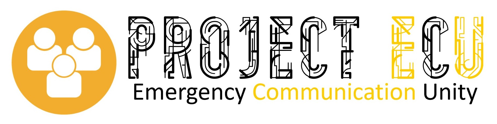
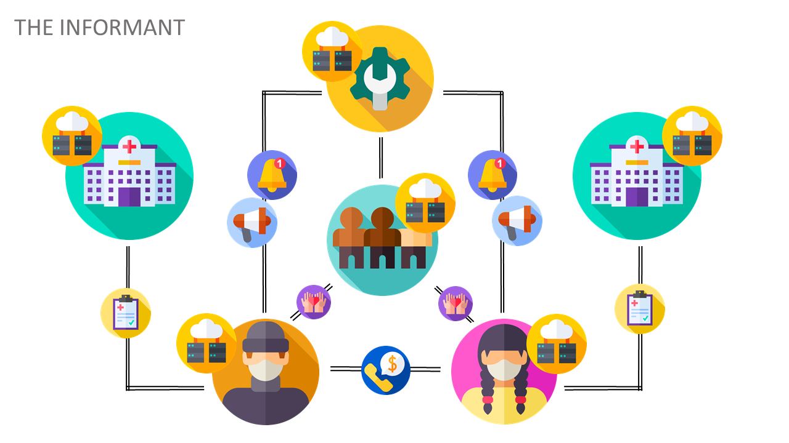
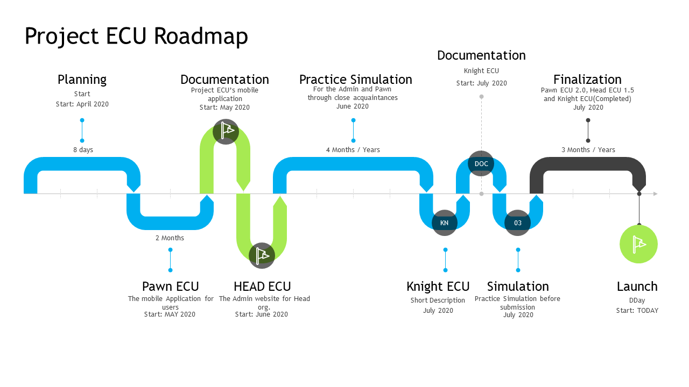

# Project ECU: A Platform that brings the Community Together through Information

The github repository for Call for Code submission and response intiative for the track COVID-19. This repository contains 3 roles. Those roles are the Admin, The additional manpower services and the independent users, the basic necessities for a well-functioned community.  

# Contents
1. [Short Description](#Short-Description)
1. [Explanation Video](#Explanation-Video)
1. [Project Roadmap](#Project-Roadmap)
1. [The Architecture](#The-Architecture)
1. [Long Description](#Long-Description)
1. [Getting Started](#Getting-Started)
1. [Live Demo](#Live-Demo)
1. [API's and Services used](#APIs-and-Services-used)
1. [Authors](#Authors)`


## Short Desciption 

### What is the problem

In reponse of the government to the COVID-19 pandemic, a community quarrantine is issued. As a result, a great impact on the community's essential services couldn't take the overwhelming number of people in need of this services. The blow of the quarrantine and the astounding number of cases could have been migitated if there was an early on contact tracer and service provider online to help guide people in need of this services that are focused on a localized level. This is the matter we had fewer counter-measures for therefore the effects of uncooperative people are steadily increasing.  

### How can Technology help?

Contact tracing and Essential Services can be provided through the right amount of information it needs to disclose. As such, the need of a platform to interact and secure information in a local manner is essential if we want the number of uncooperative people to migitate.

To do so,a platform for local communities to further collaborate in community services and activities through providing the basic services via information sharing and tracking to ease up the burden of impacted local business and volunteer events that could be of help to the community. Collaboration through information and awareness is what we need to promote, so that those with the will and idea could promote them with ease with this platform.   

### The Idea
Providing the basic services via information sharing and tracking alongside with the call of opportunity can give people a virtual interaction they need to help in the times of crisis such as the COVID-19 pandemic. Users can assess situations and track ongoing events that needs a local level of cooperation on a live feed in order to fully track the situation at hand.

#### Distibuted System
The project is based-off a distributed system that can support a community even if one or two Heads are down in the moment. We create a community that can support each other as long as they are within vicinity. The Illustration below shows the the role played by our Entities. 



This is the basic flow of the interaction of the three entites; namely, The Head, The Knight, and The Pawn . We send notifications and announcement through the Head and store them to keep the pawns updated while in turn, the users responsible then responds to the information sent by the Head. The knights then gets the information responded if it falls under their domain. For example, the medical history of a pawn within their vicinity falls under the domain of the Hospital knight, therefore it shall be given to them as per the pawn's permission.  

## Explanation Video 
[]

## Project Roadmap



## Long Description
You can see more of our project details [here](Description.md)

## Getting Started
These instructions will get you a copy of the project up and running on your local machine for development and testing purposes. See deployment for notes on how to deploy the project on a live system.

### Prerequisites
What things you need to install the software and how to install them

For the Web Application we use **Flask** as our  micro web framework.
```flask
pip install flask
```
For the Database, we use **Firebase Database**.
```firebase_admin
pip install firebase_admin

pip install pyrebase
```

For Push Notifications, we use **Onesignal**. the *SDK and other credentials* needed for the API are present. 
```onesignal
pip install onesignal
```

For the Computation of the Distance and to get the location of the Admin, we use **Geocoder** and **Geopy**.
```geocoder
pip install geocoder

pip install geopy
```

### Installing the App
The mobile application is only available for Android with the minimum version of 4.4.4(API 19).   


## Live Demo

[]

## API's and Services used

* [IBM Watson Assistant](https://www.ibm.com/cloud/watson-assistant/) - Chat bot that guides users in using the app.
* [Firebase Database](https://firebase.google.com/) - No SQL Database used
* [Google Places API](https://developers.google.com/places/web-service/intro) - For Nearby Places to assist user in locating emergency portals
* [OneSignal API](https://app.onesignal.com/) - notifications
* [Google Directions API](https://developers.google.com/maps/documentation/directions/start) - For Navigation and directions.
* [QR Code API](http://goqr.me/) - For contact tracing QR codes.


## Authors
* Spitzc32
* LowKeyProgrammer


