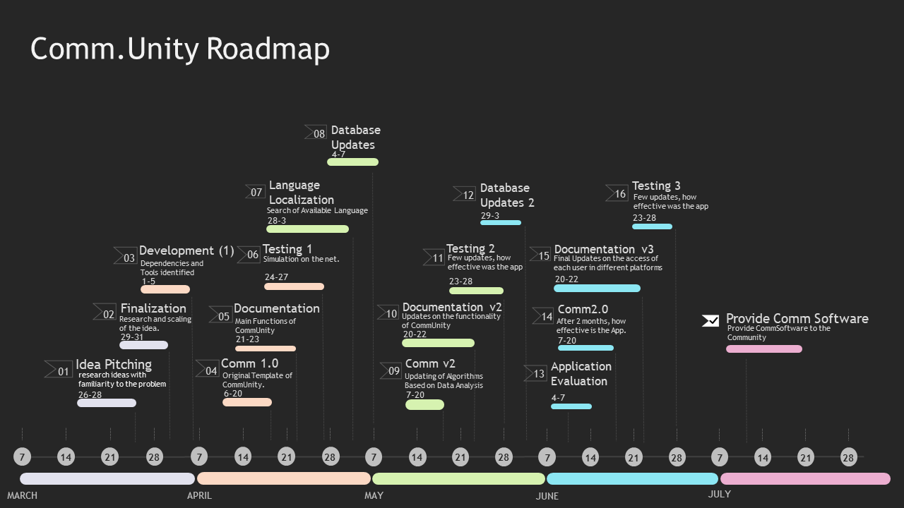

# Project ECU: Emergency Communication Unity Response for COVID-19

The github repository for Call for Code submission and response intiative for the track COVID-19.

# Contents
1. [Short Description](#Short-Description)
1. [Demo Video](#Demo-Video)
1. [Project Roadmap](#Project-Roadmap)
1. [The Architecture](#The-Architecture)
1. [Live Demo](#Live-Demo)
1. [API's and Services used](#APIs-used)
1. [Authors](#Authors)

## Short Desciption 

### What is the problem

In reponse of the government to the pandemic, a community quarrantine is issued. The first one to be affected in access will be the necessary services as they focus on implementing the community quarrantine with few counter measures. As such, people that are in need of these services are qeueing in an overwhelming matter, making the quarrantine harder and harder to bear. If such services were provided, we could migitate the number of uncooperative people to further implement the quarrantine whilst preventing the extension of the quarrantine.

### How can Technology help?

Local communities can further collaborate in community services and activities through providing the basic services needed to ease up the burden of taking long lines just to buy those necessities whilst giving the community a chance of collaboration to productively finish a volunteer task in a matter of time. In terms of Emergencies, Due to the lack of Public Transportation, we can call for local collaboration as well as inform the nearby authorities and hospitals of what is happening and how they can prepare.

### The Idea
Providing the basic services and the call of opportunity can give people a virtual interaction they need to help in the times of crisis such as the COVID-19 pandemic. Users can assess situations and track ongoing events that needs a local level of cooperation on a live feed in order to fully track the situation at hand.

## Demo Video
[]

## Project Roadmap

## The Architecture

1. The user logs in using Google's OAuth Authentication
2. Their location is connected via places API to other clusters of services offered in the neraby area
3. 
4. The user is guided by Watson AI if he/she is in need of help of accesing a service or if he/she has a question at hand.

## Live Demo

[]

## API's used

* [IBM Watson Assistant](https://www.ibm.com/cloud/watson-assistant/)
* [Firebase Database](https://firebase.google.com/) - No SQL Database used
* [Facebook API](https://developers.facebook.com/products)- Facebook's Authentication and Messenger services used
* [Google Places API](https://developers.google.com/places/web-service/intro) - Places' Geolocation API used
* [OneSignal API](https://app.onesignal.com/)

## Authors
* Spitzc32
* LowKeyProgrammer

